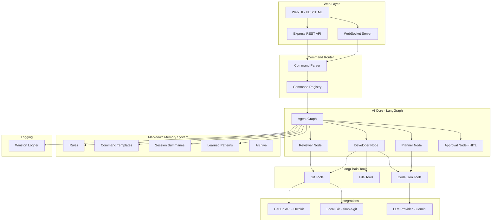
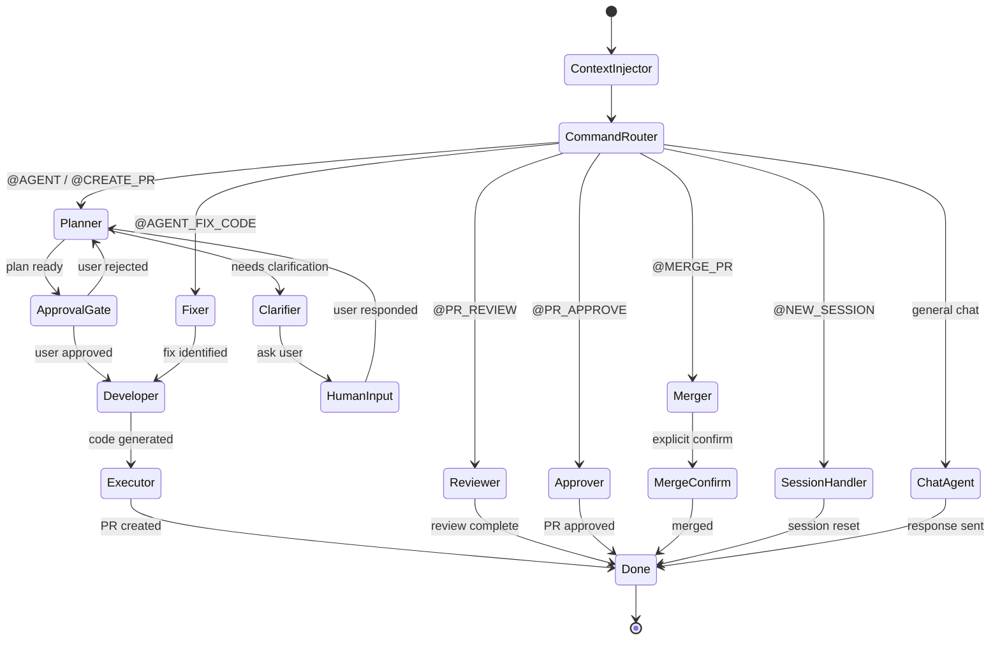
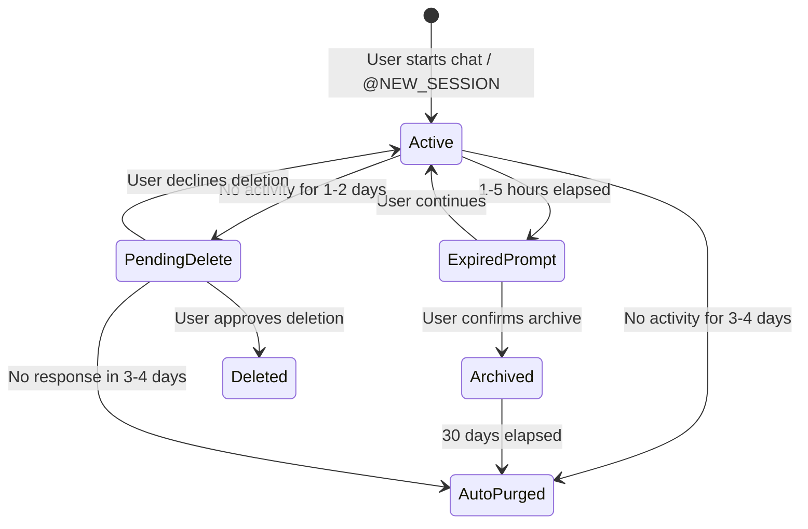

# Project Jarvis — AI Git Workflow Assistant

> An intelligent, Git-integrated development workflow system using **Node.js**, **LangChain**, **LangGraph**, and **Google Gemini**.

---

## Background

We are building a greenfield Node.js/TypeScript application that serves as an AI-powered developer assistant. It understands user intent, generates code, manages Git repositories, and performs full PR lifecycle operations — all through a chat interface with structured commands.

### Decisions Confirmed

| Question | Decision |
|----------|----------|
| Git Provider | **GitHub only** (Phase 1) |
| Authentication | **Both PAT and GitHub App** — auto-detected from `.env` |
| Repository Scope | **Single pre-configured repo** |
| Development Workspace | **Local workspace** with clone-and-start support |
| API Key | From `.env` file (`GOOGLE_API_KEY`) |
| Gemini Model | `gemini-2.5-flash` (configurable) |
| Database | **None** — Markdown-based persistence only |
| Session Lifetime | **1–5 hours active**, 1–2 day retention, 3–4 day auto-purge |

---

## Architecture Overview



---

## Directory Structure

```
Project Jarvis/
├── src/
│   ├── index.ts                            # Application entry point
│   │
│   ├── config/
│   │   ├── index.ts                        # Centralized config loader
│   │   ├── models.ts                       # LLM model registry
│   │   └── constants.ts                    # App-wide constants
│   │
│   ├── types/
│   │   ├── index.ts                        # Barrel export
│   │   ├── config.types.ts                 # Config interfaces
│   │   ├── command.types.ts                # Command-related types
│   │   ├── graph.types.ts                  # LangGraph state types
│   │   ├── git.types.ts                    # Git/GitHub types
│   │   ├── session.types.ts                # Session types
│   │   ├── memory.types.ts                 # Context/memory types
│   │   └── web.types.ts                    # API request/response types
│   │
│   ├── enums/
│   │   ├── index.ts                        # Barrel export
│   │   ├── command.enum.ts                 # CommandName, CommandStatus
│   │   ├── session.enum.ts                 # SessionStatus, SessionAction
│   │   ├── git.enum.ts                     # MergeMethod, PRState, ReviewEvent
│   │   ├── log-level.enum.ts               # LogLevel
│   │   └── llm.enum.ts                     # LLMProvider
│   │
│   ├── errors/
│   │   ├── index.ts                        # Barrel export
│   │   ├── base.error.ts                   # BaseAppError (extends Error)
│   │   ├── validation.error.ts             # ValidationError
│   │   ├── git.error.ts                    # GitOperationError
│   │   ├── github.error.ts                 # GitHubApiError
│   │   ├── llm.error.ts                    # LLMError
│   │   ├── command.error.ts                # CommandError
│   │   └── session.error.ts                # SessionError
│   │
│   ├── llm/
│   │   ├── provider.ts                     # Model abstraction factory
│   │   └── providers/
│   │       ├── gemini.provider.ts          # Google Gemini wrapper
│   │       └── openai.provider.ts          # OpenAI stub (future)
│   │
│   ├── commands/
│   │   ├── registry.ts                     # Dynamic command registry
│   │   ├── parser.ts                       # @COMMAND input parser
│   │   └── handlers/
│   │       ├── agent.handler.ts            # @AGENT
│   │       ├── agent-fix-code.handler.ts   # @AGENT_FIX_CODE
│   │       ├── create-pr.handler.ts        # @CREATE_PR
│   │       ├── pr-review.handler.ts        # @PR_REVIEW
│   │       ├── pr-approve.handler.ts       # @PR_APPROVE
│   │       ├── merge-pr.handler.ts         # @MERGE_PR
│   │       └── new-session.handler.ts      # @NEW_SESSION
│   │
│   ├── graph/
│   │   ├── state.ts                        # LangGraph state annotation
│   │   ├── workflow.ts                     # Main agent graph builder
│   │   └── nodes/
│   │       ├── context-injector.node.ts    # Load markdown context
│   │       ├── command-router.node.ts      # Route to correct workflow
│   │       ├── planner.node.ts             # Requirement analysis + planning
│   │       ├── clarifier.node.ts           # Ask clarifying questions
│   │       ├── developer.node.ts           # Code generation
│   │       ├── reviewer.node.ts            # PR review
│   │       ├── approval.node.ts            # Human-in-the-loop (interrupt)
│   │       └── executor.node.ts            # Git operations
│   │
│   ├── services/
│   │   ├── git.service.ts                  # Local Git business logic
│   │   ├── github.service.ts               # GitHub API business logic
│   │   ├── llm.service.ts                  # LLM invocation logic
│   │   ├── session.service.ts              # Session lifecycle management
│   │   └── context.service.ts              # Context read/write orchestration
│   │
│   ├── tools/
│   │   ├── git.tools.ts                    # LangChain tool wrappers: Git
│   │   ├── github.tools.ts                 # LangChain tool wrappers: GitHub
│   │   ├── file.tools.ts                   # LangChain tool wrappers: File I/O
│   │   └── code.tools.ts                   # LangChain tool wrappers: Code analysis
│   │
│   ├── memory/
│   │   ├── context-loader.ts               # Selective MD reader
│   │   ├── context-writer.ts               # Append-only MD writer
│   │   ├── prompt-injector.ts              # Assemble LLM prompt
│   │   ├── session-manager.ts              # Session create/expire/archive
│   │   └── archive-manager.ts              # Rotation, cleanup, auto-purge
│   │
│   ├── logger/
│   │   └── index.ts                        # Winston structured logger
│   │
│   ├── utils/
│   │   ├── file.util.ts                    # FS helpers (readMd, writeMd, etc.)
│   │   ├── date.util.ts                    # Date/time helpers
│   │   ├── string.util.ts                  # String sanitization, truncation
│   │   └── validation.util.ts              # Zod schemas, input validators
│   │
│   └── web/
│       ├── server.ts                       # Express + WebSocket bootstrap
│       ├── routes/
│       │   ├── chat.routes.ts              # Chat API endpoints
│       │   ├── session.routes.ts           # Session API endpoints
│       │   └── config.routes.ts            # Config API endpoints
│       └── views/
│           ├── layouts/
│           │   └── main.hbs                # Main layout
│           ├── index.hbs                   # Chat interface
│           └── partials/
│               ├── header.hbs
│               ├── sidebar.hbs
│               └── message.hbs
│
├── context/                                # 📂 Markdown-based persistence
│   ├── rules/
│   │   ├── system_rules.md                 # 🔒 Core identity & behavior
│   │   └── anti_hallucination.md           # 🔒 Anti-hallucination rules
│   ├── commands/
│   │   ├── agent.md                        # 🔒 @AGENT template
│   │   ├── agent_fix_code.md               # 🔒 @AGENT_FIX_CODE template
│   │   ├── create_pr.md                    # 🔒 @CREATE_PR template
│   │   ├── pr_review.md                    # 🔒 @PR_REVIEW template
│   │   ├── pr_approve.md                   # 🔒 @PR_APPROVE template
│   │   ├── merge_pr.md                     # 🔒 @MERGE_PR template
│   │   └── new_session.md                  # 🔒 @NEW_SESSION template
│   ├── agents/
│   │   └── code_generation_guidelines.md   # 🔒 Code quality standards
│   ├── sessions/
│   │   └── session_<uuid>.md               # 🔄 Active session summaries
│   ├── memory/
│   │   └── learned_patterns.md             # 📝 Accumulated lessons
│   ├── workflows/
│   │   └── pr_lifecycle.md                 # 🔒 Workflow definitions
│   └── archive/
│       └── session_<uuid>_<date>.md        # 🗄️ Archived sessions
│
├── public/
│   ├── css/
│   │   └── styles.css                      # Dark theme + glassmorphism
│   └── js/
│       └── chat.js                         # Client-side WebSocket logic
│
├── logs/                                   # Runtime logs (gitignored)
├── workspace/                              # Cloned repo (gitignored)
├── .env.example
├── .env                                    # User secrets (gitignored)
├── .gitignore
├── package.json
├── tsconfig.json
└── README.md
```

---

## Proposed Changes — Component Details

> [!IMPORTANT]
> **Code Quality Contract**: All generated code must follow the standards defined in [code_generation_guidelines.md](file:///Users/mindpath/Project%20Jarvis/context/agents/code_generation_guidelines.md). This file is loaded into every LLM call to ensure consistent, production-grade output.

---

### 1. Types & Enums (Separate Directories)

#### [NEW] [types/](file:///Users/mindpath/Project%20Jarvis/src/types/)

All data structures defined as TypeScript interfaces, grouped by domain:

```ts
// types/config.types.ts
export interface AppConfig {
  server: ServerConfig;
  llm: LLMConfig;
  github: GitHubConfig;
  workspace: WorkspaceConfig;
  context: ContextConfig;
  log: LogConfig;
}

export interface GitHubConfig {
  authMode: GitHubAuthMode;
  token?: string;
  appId?: string;
  privateKey?: string;
  installationId?: string;
  owner: string;
  repo: string;
  defaultBranch: string;
}

// types/command.types.ts
export interface ParsedCommand {
  isCommand: boolean;
  command: CommandName | null;
  args: CommandArgs;
  rawMessage: string;
  messageBody: string;
}

export interface CommandHandler {
  name: CommandName;
  description: string;
  execute(args: CommandArgs, sessionId: string): Promise<CommandResult>;
}

// types/session.types.ts
export interface Session {
  id: string;
  createdAt: Date;
  lastActiveAt: Date;
  expiresAt: Date;
  status: SessionStatus;
  intent: string;
  decisions: string[];
  actions: SessionAction[];
  currentState: string;
  learned: string[];
}
```

#### [NEW] [enums/](file:///Users/mindpath/Project%20Jarvis/src/enums/)

All enums grouped by domain:

```ts
// enums/command.enum.ts
export enum CommandName {
  AGENT = 'AGENT',
  AGENT_FIX_CODE = 'AGENT_FIX_CODE',
  CREATE_PR = 'CREATE_PR',
  PR_REVIEW = 'PR_REVIEW',
  PR_APPROVE = 'PR_APPROVE',
  MERGE_PR = 'MERGE_PR',
  NEW_SESSION = 'NEW_SESSION',
}

// enums/session.enum.ts
export enum SessionStatus {
  ACTIVE = 'active',
  EXPIRED = 'expired',
  ARCHIVED = 'archived',
  PENDING_DELETE = 'pending_delete',
}

// enums/git.enum.ts
export enum MergeMethod { MERGE = 'merge', SQUASH = 'squash', REBASE = 'rebase' }
export enum PRState { OPEN = 'open', CLOSED = 'closed', ALL = 'all' }
export enum ReviewEvent { APPROVE = 'APPROVE', REQUEST_CHANGES = 'REQUEST_CHANGES', COMMENT = 'COMMENT' }

// enums/llm.enum.ts
export enum LLMProvider { GEMINI = 'gemini', OPENAI = 'openai', ANTHROPIC = 'anthropic' }
```

---

### 2. Custom Error Classes

#### [NEW] [errors/](file:///Users/mindpath/Project%20Jarvis/src/errors/)

Hierarchical error system:

```ts
// errors/base.error.ts
export class BaseAppError extends Error {
  constructor(
    message: string,
    public readonly code: string,
    public readonly statusCode: number = 500,
    public readonly isOperational: boolean = true,
    public readonly context?: Record<string, unknown>,
  ) {
    super(message);
    this.name = this.constructor.name;
    Error.captureStackTrace(this, this.constructor);
  }
}

// errors/git.error.ts
export class GitOperationError extends BaseAppError {
  constructor(operation: string, detail: string, context?: Record<string, unknown>) {
    super(`Git ${operation} failed: ${detail}`, 'GIT_OPERATION_ERROR', 500, true, context);
  }
}

// errors/validation.error.ts
export class ValidationError extends BaseAppError {
  constructor(field: string, detail: string) {
    super(`Validation failed for "${field}": ${detail}`, 'VALIDATION_ERROR', 400);
  }
}
```

---

### 3. Config System

#### [NEW] [config/index.ts](file:///Users/mindpath/Project%20Jarvis/src/config/index.ts)

- Loads `.env` via `dotenv`
- Validates all required keys using Zod schemas
- Auto-detects GitHub auth mode: PAT if `GITHUB_TOKEN` present, App if `GITHUB_APP_ID` + `GITHUB_PRIVATE_KEY_PATH` + `GITHUB_INSTALLATION_ID` present
- Exports frozen `AppConfig` singleton

#### [NEW] [config/constants.ts](file:///Users/mindpath/Project%20Jarvis/src/config/constants.ts)

```ts
export const SESSION_ACTIVE_WINDOW_HOURS = 5;
export const SESSION_RETENTION_DAYS = 2;
export const SESSION_AUTO_PURGE_DAYS = 4;
export const CONTEXT_MAX_FILE_SIZE_KB = 500;
export const ARCHIVE_RETENTION_DAYS = 30;
export const LEARNED_PATTERNS_MAX_ENTRIES = 200;
```

---

### 4. LLM Abstraction Layer

#### [NEW] [llm/provider.ts](file:///Users/mindpath/Project%20Jarvis/src/llm/provider.ts)

Factory returning `BaseChatModel`:

```ts
export function createLLMProvider(config: LLMConfig): BaseChatModel {
  switch (config.provider) {
    case LLMProvider.GEMINI:
      return createGeminiProvider(config);
    case LLMProvider.OPENAI:
      return createOpenAIProvider(config);
    default:
      throw new LLMError(`Unsupported provider: ${config.provider}`);
  }
}
```

---

### 5. Command System

#### [NEW] [commands/parser.ts](file:///Users/mindpath/Project%20Jarvis/src/commands/parser.ts)

```ts
/**
 * Parses user input for structured @COMMAND patterns.
 * Returns ParsedCommand with extracted command name, args, and message body.
 * Falls back to general chat if no command prefix detected.
 */
export function parseUserInput(input: string): ParsedCommand
```

#### [NEW] [commands/registry.ts](file:///Users/mindpath/Project%20Jarvis/src/commands/registry.ts)

```ts
/**
 * Dynamic command registry with auto-discovery.
 * Loads prompt templates from context/commands/*.md on initialization.
 * Supports runtime registration of new commands.
 */
export class CommandRegistry {
  register(handler: CommandHandler): void;
  get(name: CommandName): CommandHandler | undefined;
  listAll(): CommandHandler[];
  hasCommand(name: string): boolean;
}
```

#### [NEW] Commands (7 total)

| Command | Handler File | Description |
|---------|-------------|-------------|
| `@AGENT` | `agent.handler.ts` | Analyze idea → clarify → plan → approve → generate code |
| `@AGENT_FIX_CODE` | `agent-fix-code.handler.ts` | Analyze code → identify issues → generate fix |
| `@CREATE_PR` | `create-pr.handler.ts` | Branch → generate code → commit → push → create PR |
| `@PR_REVIEW` | `pr-review.handler.ts` | Fetch PR diff → analyze → structured review |
| `@PR_APPROVE` | `pr-approve.handler.ts` | Validate → submit approval |
| `@MERGE_PR` | `merge-pr.handler.ts` | Verify approval → confirm → merge (explicit only) |
| `@NEW_SESSION` | `new-session.handler.ts` | Archive current session → start fresh |

---

### 6. LangGraph Workflow Engine

#### [NEW] [graph/state.ts](file:///Users/mindpath/Project%20Jarvis/src/graph/state.ts)

```ts
const AgentState = Annotation.Root({
  messages: Annotation<BaseMessage[]>({ reducer: messagesStateReducer }),
  sessionId: Annotation<string>,

  command: Annotation<string>,
  commandArgs: Annotation<Record<string, unknown>>,

  plan: Annotation<string>,
  planApproved: Annotation<boolean>,
  clarificationNeeded: Annotation<boolean>,
  clarificationQuestion: Annotation<string>,

  generatedCode: Annotation<Map<string, string>>,
  generatedFiles: Annotation<string[]>,

  reviewFeedback: Annotation<string>,
  reviewApproved: Annotation<boolean>,

  gitBranch: Annotation<string>,
  prNumber: Annotation<number>,
  prUrl: Annotation<string>,

  systemContext: Annotation<string>,
  commandContext: Annotation<string>,
  sessionContext: Annotation<string>,
  learnedContext: Annotation<string>,
  agentGuidelines: Annotation<string>,

  executionLog: Annotation<string[]>({ reducer: (a, b) => [...a, ...b] }),
});
```

#### [NEW] [graph/workflow.ts](file:///Users/mindpath/Project%20Jarvis/src/graph/workflow.ts)



- **Checkpointer**: `MemorySaver` for Phase 1
- **Human-in-the-loop**: `interrupt()` at `ApprovalGate` and `MergeConfirm`
- **Thread-based**: Each session gets a unique `thread_id`
- **Context injection**: First node always loads agent guidelines + relevant markdown context

#### [NEW] [graph/nodes/*.ts](file:///Users/mindpath/Project%20Jarvis/src/graph/nodes/)

| Node | File | Responsibility |
|------|------|---------------|
| Context Injector | `context-injector.node.ts` | Load rules + command template + session + guidelines |
| Command Router | `command-router.node.ts` | Conditional routing based on parsed command |
| Planner | `planner.node.ts` | Analyze requirements, generate structured plan |
| Clarifier | `clarifier.node.ts` | Detect ambiguity, ask clarifying questions |
| Developer | `developer.node.ts` | Generate code following `code_generation_guidelines.md` |
| Reviewer | `reviewer.node.ts` | Analyze PR diff, structured review |
| Approval | `approval.node.ts` | `interrupt()` — pause for human approval |
| Executor | `executor.node.ts` | Branch → write files → commit → push → create PR |

---

### 7. Services Layer

#### [NEW] [services/](file:///Users/mindpath/Project%20Jarvis/src/services/)

Business logic separated from tools and handlers:

```ts
// services/git.service.ts
export class GitService {
  async cloneRepository(url: string, targetPath: string): Promise<void>;
  async createBranch(branchName: string): Promise<void>;
  async commitAndPush(message: string, files: string[], branch: string): Promise<void>;
  async getCurrentBranch(): Promise<string>;
  async getDiff(base: string, head: string): Promise<string>;
}

// services/github.service.ts
export class GitHubService {
  async createPullRequest(params: CreatePRParams): Promise<PRResult>;
  async getPullRequest(prNumber: number): Promise<PRDetails>;
  async getPullRequestDiff(prNumber: number): Promise<string>;
  async submitReview(prNumber: number, body: string, event: ReviewEvent): Promise<void>;
  async mergePullRequest(prNumber: number, method: MergeMethod): Promise<void>;
}

// services/session.service.ts
export class SessionService {
  async createSession(): Promise<Session>;
  async getActiveSession(sessionId: string): Promise<Session | null>;
  async expireSession(sessionId: string): Promise<void>;
  async archiveSession(sessionId: string): Promise<void>;
  async promptSessionCleanup(sessionId: string): Promise<SessionCleanupPrompt>;
  async runAutoCleanup(): Promise<CleanupResult>;
}

// services/context.service.ts
export class ContextService {
  async loadForCommand(command: CommandName, sessionId: string): Promise<AssembledContext>;
  async appendLearning(pattern: string): Promise<void>;
  async appendAntiHallucination(rule: string): Promise<void>;
}
```

---

### 8. Session Management (Refined Strategy)

#### Session Lifecycle



#### Rules

| Rule | Behavior |
|------|----------|
| **Active window** | Session stays active for **1 to 5 hours** (configurable) |
| **Expiry prompt** | After active window expires, prompt user: _"Your session has been active for X hours. Would you like to start a new session? Use `@NEW_SESSION` to start fresh."_ |
| **Context retention** | Session context files retained for **1–2 days** after last activity |
| **Pre-delete confirmation** | Before deleting any session data, system must: (1) Show a brief summary of the session, (2) Ask user to confirm deletion |
| **Auto-purge** | If **no user activity for 3–4 days**, auto-delete session data (no confirmation needed) |
| **Archival** | Completed/expired sessions moved to `context/archive/` |
| **Permanent data** | `rules/*`, `commands/*`, `agents/*`, `workflows/*`, `memory/*` are **never** auto-deleted |

#### Session File Format

```markdown
# Session: <uuid>

| Field | Value |
|-------|-------|
| Created | 2026-04-05T22:30:00Z |
| Last Active | 2026-04-05T23:15:00Z |
| Expires At | 2026-04-06T03:30:00Z |
| Status | active |

## User Intent
Create a login feature with JWT authentication

## Key Decisions
- Use JWT with RS256 algorithm
- Store refresh tokens in httpOnly cookies
- Use Express middleware for route protection

## Actions Taken
- [x] Plan approved by user
- [x] Code generated: src/auth/jwt.ts, src/middleware/auth.ts
- [x] PR #12 created: feature/jwt-auth → main
- [ ] Pending review

## Current State
PR created, awaiting review command

## Learned
- User prefers async/await over .then() chains
- Project uses ESM imports, not CommonJS
```

#### `@NEW_SESSION` Command

```ts
// When user sends @NEW_SESSION:
// 1. Summarize current session
// 2. Archive current session → context/archive/
// 3. Create fresh session file → context/sessions/
// 4. Reset LangGraph thread_id
// 5. Respond: "New session started. Session <old-id> has been archived."
```

---

### 9. Markdown Memory System

#### What Goes Into MD vs. What Doesn't

| ✅ Store in MD | ❌ Do NOT Store |
|---|---|
| Prompt templates | Raw chat history |
| Command definitions | Full execution logs (use Winston) |
| System rules | Temporary execution data |
| Anti-hallucination rules | Binary/media files |
| Learned corrections | LLM raw responses |
| Session summaries (compact) | |
| Agent coding guidelines | |

#### Context Loader — Selective Read Strategy

```ts
// Per LLM call, load ONLY:
// 1. rules/system_rules.md          ← ALWAYS
// 2. rules/anti_hallucination.md    ← ALWAYS
// 3. agents/code_generation_guidelines.md ← ALWAYS for code tasks
// 4. commands/<command>.md          ← IF command detected
// 5. sessions/session_<id>.md       ← IF session active
// 6. memory/learned_patterns.md     ← Last 50 entries
//
// NEVER load: all files, archived sessions, other sessions
```

#### Context Writer — Deterministic Write Rules

| Event | Target File | Operation |
|-------|------------|-----------|
| New rule from user | `rules/system_rules.md` | **Append** (never overwrite) |
| Mistake detected | `rules/anti_hallucination.md` | **Append** (never overwrite) |
| New session started | `sessions/session_<id>.md` | **Create** |
| Session progresses | `sessions/session_<id>.md` | **Update** (specific sections) |
| Useful pattern learned | `memory/learned_patterns.md` | **Append** |
| Session expired | `sessions/ → archive/` | **Move** |
| Command template | `commands/*.md` | **Never auto-modified** |
| Agent guidelines | `agents/*.md` | **Never auto-modified** |

#### Size Enforcement

```
If session file > 500KB:
  1. Generate structured summary of SESSION DATA ONLY
  2. Move original to archive/
  3. Replace with compact summary
  ❗ CRITICAL: Predefined rules/commands/agents are NEVER summarized or overwritten

If learned_patterns.md > 500KB:
  1. Summarize oldest 50% of entries
  2. Keep most recent entries intact
  3. Prepend summary block at top
```

#### Retention Rules

| Category | Retention | Action on Expiry |
|----------|-----------|------------------|
| `rules/*` | ♾️ Permanent | Never deleted |
| `commands/*` | ♾️ Permanent | Never deleted |
| `agents/*` | ♾️ Permanent | Never deleted |
| `workflows/*` | ♾️ Permanent | Never deleted |
| `memory/learned_patterns.md` | ♾️ Permanent | Summarize if > 500KB |
| `sessions/*` (active) | 1–5 hours active | Prompt user on expiry |
| `sessions/*` (no activity) | 1–2 days | Prompt before delete |
| `sessions/*` (abandoned) | 3–4 days no activity | Auto-purge |
| `archive/*` | 30 days | Hard delete |

---

### 10. LangChain Tools

#### [NEW] [tools/git.tools.ts](file:///Users/mindpath/Project%20Jarvis/src/tools/git.tools.ts)

LangChain `@tool` wrappers delegating to `GitService`:

```ts
cloneRepository, createBranch, checkoutBranch, stageFiles,
commitChanges, pushBranch, getCurrentBranch, getDiff
```

#### [NEW] [tools/github.tools.ts](file:///Users/mindpath/Project%20Jarvis/src/tools/github.tools.ts)

LangChain `@tool` wrappers delegating to `GitHubService`:

```ts
createPullRequest, getPullRequest, getPullRequestDiff,
listPullRequests, submitReview, mergePullRequest
```

**Merge guard**: `mergePullRequest` tool always requires explicit user confirmation — never called without `@MERGE_PR` command.

#### [NEW] [tools/file.tools.ts](file:///Users/mindpath/Project%20Jarvis/src/tools/file.tools.ts)

```ts
readFile, writeFile, listDirectory, deleteFile, fileExists
```

#### [NEW] [tools/code.tools.ts](file:///Users/mindpath/Project%20Jarvis/src/tools/code.tools.ts)

```ts
analyzeCodeStructure, findPotentialIssues, suggestFix
```

---

### 11. Logger

#### [NEW] [logger/index.ts](file:///Users/mindpath/Project%20Jarvis/src/logger/index.ts)

Winston structured logger:

```ts
// Transports:
//   Console → colorized (dev) / JSON (prod)
//   File    → logs/app-YYYY-MM-DD.log
//   Error   → logs/error-YYYY-MM-DD.log
//
// Fields per entry: timestamp, level, message, sessionId, node, operation, duration
//
// Usage:
//   logger.info('Creating PR', { repo, branch, sessionId });
//   logger.error('Git push failed', { error, branch, sessionId });
```

---

### 12. Web Interface

#### [NEW] [web/server.ts](file:///Users/mindpath/Project%20Jarvis/src/web/server.ts)

- Express + Handlebars + WebSocket (`ws`)
- REST endpoints: `POST /api/chat`, `GET /api/sessions`, `POST /api/sessions/new`
- Static files from `public/`

#### [NEW] [web/views/index.hbs](file:///Users/mindpath/Project%20Jarvis/src/web/views/index.hbs)

Dark-themed chat interface with:
- Real-time WebSocket streaming
- Command autocomplete on `@` prefix
- Markdown rendering + code highlighting
- Session sidebar with status indicators
- Session expiry notifications
- Typing indicator

#### [NEW] [public/css/styles.css](file:///Users/mindpath/Project%20Jarvis/public/css/styles.css)

- CSS custom properties theming
- Dark mode + glassmorphism
- Responsive layout
- Code block syntax theme
- Message bubbles + command badges
- Micro-animations

---

### 13. Entry Point & Configuration

#### [NEW] [.env.example](file:///Users/mindpath/Project%20Jarvis/.env.example)

```env
# ──── Server ────
PORT=3000
NODE_ENV=development

# ──── LLM ────
LLM_PROVIDER=gemini
LLM_MODEL=gemini-2.5-flash
GOOGLE_API_KEY=

# ──── GitHub Auth (Option 1: PAT) ────
GITHUB_TOKEN=

# ──── GitHub Auth (Option 2: GitHub App) ────
# GITHUB_APP_ID=
# GITHUB_PRIVATE_KEY_PATH=
# GITHUB_INSTALLATION_ID=

# ──── Repository ────
GITHUB_OWNER=
GITHUB_REPO=
GITHUB_DEFAULT_BRANCH=main

# ──── Paths ────
WORKSPACE_PATH=./workspace
CONTEXT_PATH=./context

# ──── Session ────
SESSION_ACTIVE_WINDOW_HOURS=5
SESSION_RETENTION_DAYS=2
SESSION_AUTO_PURGE_DAYS=4

# ──── Context ────
CONTEXT_MAX_FILE_SIZE_KB=500
ARCHIVE_RETENTION_DAYS=30

# ──── Logging ────
LOG_LEVEL=info
```

#### [NEW] [package.json](file:///Users/mindpath/Project%20Jarvis/package.json)

```json
{
  "name": "project-jarvis",
  "version": "1.0.0",
  "type": "module",
  "scripts": {
    "dev": "tsx watch src/index.ts",
    "build": "tsc",
    "start": "node dist/index.js",
    "lint": "eslint src/",
    "clean": "rm -rf dist/"
  },
  "dependencies": {
    "@langchain/langgraph": "^0.2.x",
    "@langchain/core": "^0.3.x",
    "@langchain/google-genai": "^0.1.x",
    "@octokit/rest": "^21.x",
    "@octokit/auth-app": "^7.x",
    "simple-git": "^3.x",
    "express": "^4.x",
    "express-handlebars": "^8.x",
    "ws": "^8.x",
    "winston": "^3.x",
    "dotenv": "^16.x",
    "marked": "^15.x",
    "highlight.js": "^11.x",
    "zod": "^3.x",
    "uuid": "^11.x"
  },
  "devDependencies": {
    "typescript": "^5.x",
    "tsx": "^4.x",
    "@types/node": "^22.x",
    "@types/express": "^5.x",
    "@types/ws": "^8.x"
  }
}
```

---

## Verification Plan

### Automated Tests

| Test | Verifies |
|------|----------|
| Command parser | Parses `@AGENT`, `@PR_REVIEW #42`, `@NEW_SESSION` |
| Context loader | Loads correct MD files per request type |
| Context writer | Appends without overwriting predefined content |
| Session manager | Create → expire → prompt → archive → purge lifecycle |
| Archive manager | Rotation rules, never touches rules/commands |
| Error classes | Correct hierarchy, status codes, serialization |
| Config loader | Validates env vars, detects auth mode |

### Manual Verification

1. `npm run dev` → all components initialize without errors
2. Open `http://localhost:3000` → chat UI loads
3. Send "Hello" → AI responds via WebSocket
4. Send `@PR_REVIEW #1` → fetches diff, returns review
5. Send `@NEW_SESSION` → archives current, starts fresh
6. Verify session file created in `context/sessions/`
7. Wait 5+ hours → verify expiry prompt appears
8. Change `LLM_PROVIDER` → verify system works

---

## Development Phases Roadmap

### Phase 1: Foundation ← **Current Sprint**
- Core architecture (types, enums, errors, config)
- LLM abstraction layer (Gemini default)
- Command system (7 commands including `@NEW_SESSION`)
- LangGraph workflow engine with HITL
- Git/GitHub integration (PAT + App auth)
- Markdown memory system (split context, session lifecycle, rotation)
- Agent coding guidelines (injected into every code-gen call)
- Basic web chat UI (dark theme, WebSocket)
- Structured logging

### Phase 2: Intelligence Enhancement
- Multi-agent architecture (Planner, Developer, Reviewer agents)
- Vector store for semantic context search (Pinecone/Chroma)
- Enhanced code review with diff analysis and inline comments
- Smart prompt optimization via learned patterns
- Persistent checkpointer (SQLite)
- Conversation history with summarization chain

### Phase 3: CI/CD & DevOps Integration
- GitHub Actions integration
- Automated test execution before PR creation
- Build status monitoring and notifications
- Deployment pipeline triggers
- Branch protection rule compliance
- Webhook-based event handling

### Phase 4: Team Collaboration
- Slack integration (commands + notifications)
- Microsoft Teams integration
- Multi-user support with RBAC
- Team-shared knowledge base
- Audit trail and compliance logging
- Project-level context isolation

### Phase 5: Enterprise & Scale
- Multi-tenant architecture
- Custom model fine-tuning pipeline
- Plugin system for custom tools and commands
- Analytics dashboard (PR velocity, agent performance)
- API gateway with rate limiting
- Self-healing: automated error recovery
- Multi-repo orchestration
- Integration marketplace (Jira, Linear, Notion)
